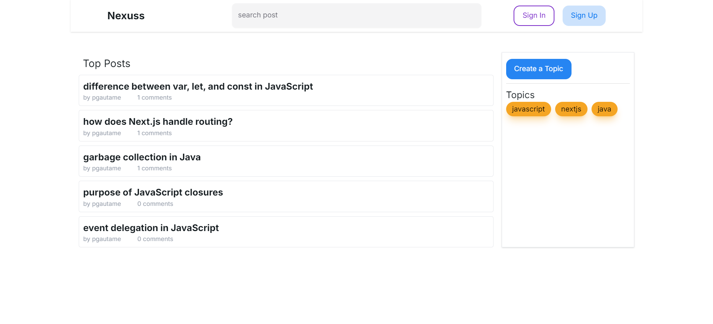
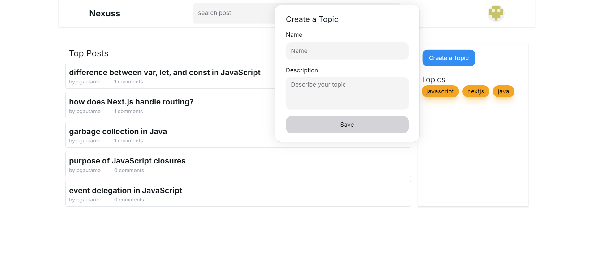
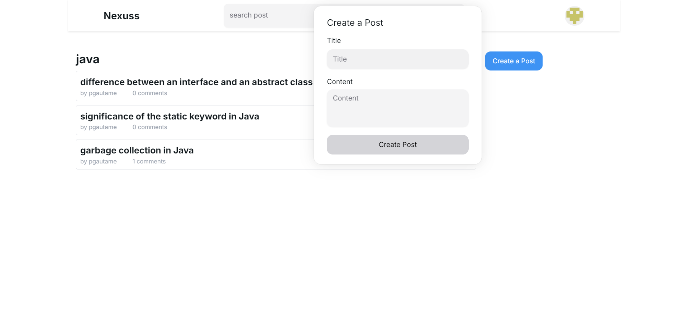
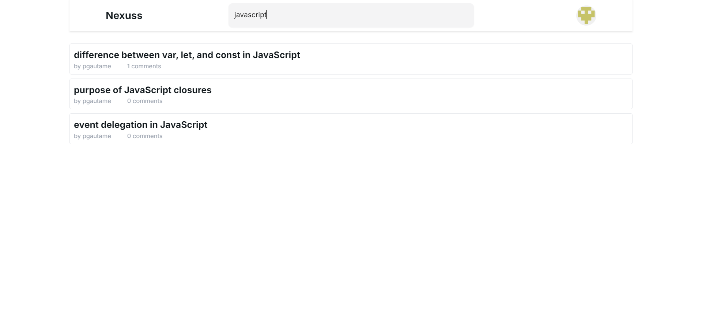
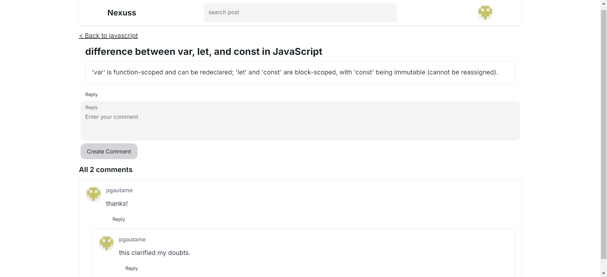

# Nexuss

Nexuss is a modern discussion platform built with Next.js, designed to facilitate meaningful conversations and information exchange. It provides users with the ability to create posts, participate in discussions through replies and comments, and explore trending topics.

## Features

- **Top Posts:** Discover the most popular posts on the platform, curated based on user engagement.
- **Topic & Post Creation:** Seamlessly create new topics and posts to share your ideas and start discussions.
- **Reply & Comment Functionality:** Engage with others by replying to posts and leaving comments.
- **Search Functionality:** Easily find posts with a simple search tool.
- **Authentication with NextAuth**: Users can log in using their GitHub accounts, providing a secure and seamless authentication process.

## Technologies

- **Next.js:** Next.js is a React framework for building full-stack web applications.
- **TypeScript:** Adds static type checking to JavaScript, improving code reliability and maintainability.
- **NextAuth with GitHub OAuth**: Secure user authentication via GitHub OAuth.
- **NextUI**: Provides a set of React components for building a modern and user-friendly interface.
- **TailwindCSS**: Utility-first CSS framework for fast and responsive design.
- **Zod**: TypeScript-first schema declaration and validation library.
- **Prisma**: ORM for database access and management.
- **SQLite**: Lightweight SQL database for efficient data storage and retrieval.
- **Request Memoization**: Caching mechanism to optimize performance by reducing redundant data fetches.
- **Suspense and Loading Skeletons**: Enhances user experience with data loading placeholders and improved asynchronous handling.

## Screenshots

  
_Home page with top posts and topics_

  
_Form for creating new discussion topics_

  
_Viewing a topic and a form for creating new post in that topic_

  
_Search bar for finding posts and topics_

  
_Viewing post, comments and replies_
